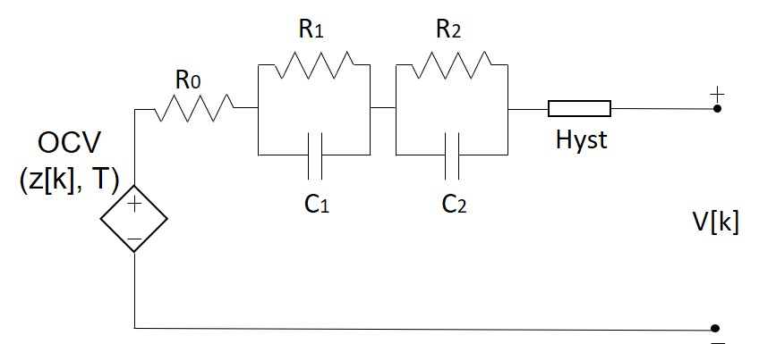
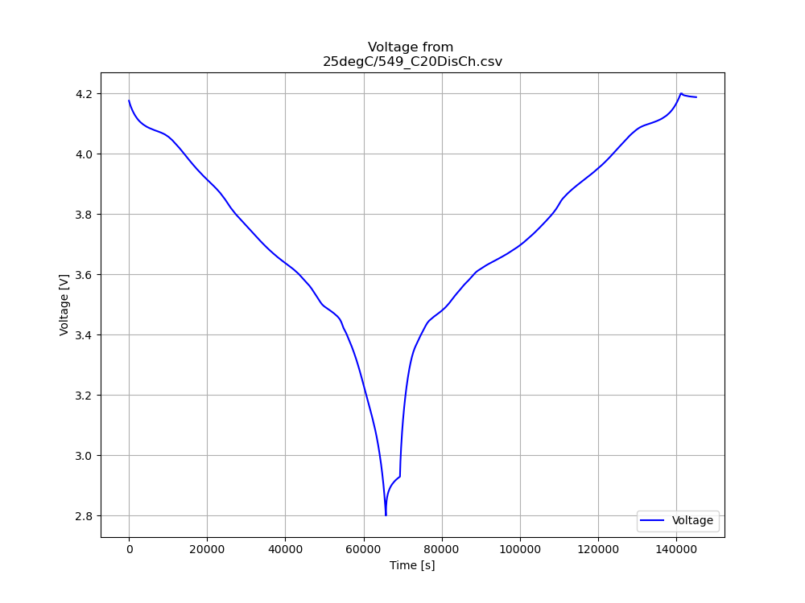
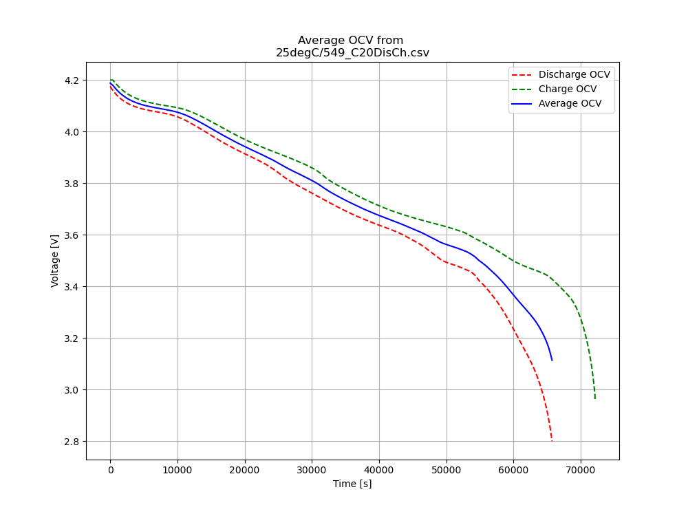
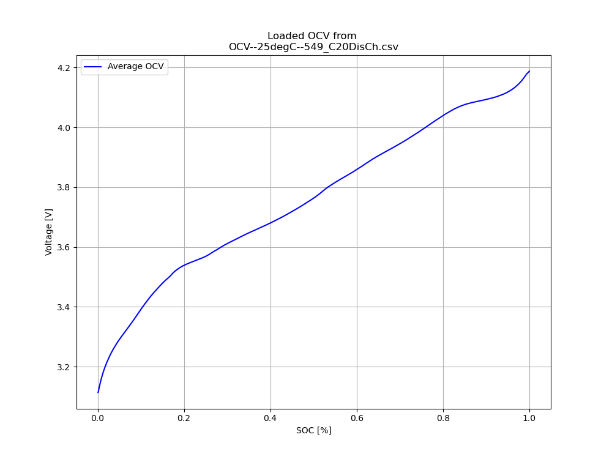

# Data Driven Modelling of Li-ion Cell Batteries
Repository for project titled ```Data-driven modelling of Li-ion Batteries```. 

## Requirements
- Python>=3.8
- Numpy
- Scipy
- Matplotlib
- Pandas

## Overview
This project is an implementation of RC link modelling of Li-ion Batteries using convex optimization to fit desired parameters.

## Open Source Datasets Used
### [LG 18650HG2](https://data.mendeley.com/datasets/cp3473x7xv/3)
- Kollmeyer, Phillip; Vidal, Carlos; Naguib Mina; Skells, Michael  (2020), “LG 18650HG2 Li-ion Battery Data and Example Deep Neural Network xEV SOC Estimator Script”, Mendeley Data, V3, doi: 10.17632/cp3473x7xv.3

## Battery Models Used
### RC2 model:
- 
### RC2 model with hysteresis:
- 

## OCV-SOC Curve Extraction
- The OCV-SOC curve is computed as the averge of the charge and discharge OCV-SOC curves extracted from OCV test data.
- 
- 
- The computed OCV-SOC curve is the stored for simulation of cell using known cell parameters.
- 

## Model Parameter Extraction
- The cell parameters are extracted from the dynamic test data using the ```minimize``` function from ```scipy.optimize```. 
- The Cumulative Root Mean Squared Error (CRMSE) between the simulated terminal voltage and actual terminal voltage for a given dynamic test is considered as the loss function to be minimized.
- The bounds of the cell parameters are defined with plausible values for the resistances and time constants of each RC branch.
- Once the parameters are trained from a training data, it is then validated on different dynamic test data by comparing the computed CRMSEs.
- 

## Results
### RC2 model:
OCV-SOC curve extracted from ```25degC/549_C20DisCh.csv```, training done on ```25degC/551_Mixed1.csv``` and validation done on ```25degC/551_LA92.csv```:

| Parameter | R0(ohm)    | R1(ohm)    | R2(ohm) | C1(farad)     | C2(farad)      | Training CRMSE(mV)   | Validation CRMSE(mV)   |
|-----------|------------|------------|---------|---------------|----------------|-------------------|--------------------|
| Value     | 0.01951358 | 0.01541913 | 0.5     | 1395.97247796 | 84959.64540431 | 20.01416826514894 | 20.095525362647045 |

### RC2 model with hysteresis: TBD